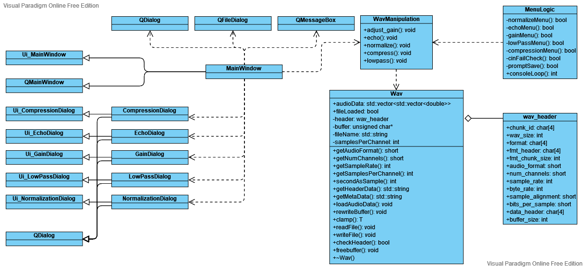

# CS 202 Fall 2021 Final Project
A program for basic processing on 8-bit and 16-bit WAV files. 

This is a **challenge level** project.

## Table of contents
- [CS 202 Fall 2021 Final Project](#cs-202-fall-2021-final-project)
  - [Table of contents](#table-of-contents)
  - [Members and contributions](#members-and-contributions)
  - [Build instructions](#build-instructions)
  - [Sample usage](#sample-usage)
    - [Selected outputs](#selected-outputs)
    - [Screenshots](#screenshots)
  - [UML diagram](#uml-diagram)
  - [Known issues and missing functionality](#known-issues-and-missing-functionality)
    - [Bugs](#bugs)
    - [Design oversights](#design-oversights)
    - [Other](#other)
  - [Challenges encountered](#challenges-encountered)
    - [Handling different audio data sizes](#handling-different-audio-data-sizes)
    - [Qt](#qt)
    - [General challenges](#general-challenges)

## Members and contributions
 - **Austin Zube** - Documentation, writeups
 - **Grant Pellegrini** - All processors
 - **Lloyd Gonzales** - Project structuring and setup (Doxyfile, makefile, folder structure); Wav class implementation; processor integration; main menu logic; Qt

## Build instructions
Note: the documentation is available on Github Pages under https://gonzales-lloyd.github.io/cs-202-final-project/index.html. **Qt files are not documented!** (See [Design oversights](#design-oversights) for reasoning)

To build the base program, `wav_manager`, run `make` in the source directory.

To generate the documentation, ensure you have `doxygen` installed from your package manager. Then, run `make docs` or `doxygen Doxyfile` from the source directory.

To generate the GUI version of the program, you may use Qt Creator to open `cs202-final-project.pro`, and run it in debug mode. (You must have Qt Creator and the Qt library installed on your platform - this project was built in Qt 6, but is compatible with Qt 5.)

Alternatively, to generate the GUI version (which requires that the Qt source be installed):
- Create a build folder in the location of your choice
- Run `qmake cs202-final-project.pro`, inserting the full path to the project file as necessary
- Run `make`

Note that release versions made through `qmake` or other means may fail. See [Design oversights](#design-oversights) for a workaround.

## Sample usage
Also known as "proof that it works on at least one computer."

### Selected outputs
All processors were run on `test-files/CantinaBand3.wav`, except for echo (which was run on `testfiles/echotest.wav`.)
- `sample_files/normalization.wav`
  - No options
- `sample_files/negative-echo.wav`
  - Start time: 0 sec
  - End time: 2.5 sec
  - Decay factor: 0.8
  - Delay: -1 sec
- `sample_files/positive-echo.wav`
  - Start time: 0 sec
  - End time: 2.5 sec
  - Decay factor: 0.8
  - Delay: 0 sec
- `sample_files/gain.wav`
  - Scale factor: 0.1
- `sample_files/lowpass.wav` (This file may be loud! It was run through the gain processor with a scale of 0.5 to try to compensate.)
  - Sample delay: 2
  - Gain: 1
- `sample_files/compression.wav`
  - Threshold: 0.01
  - Attenuation factor: 0.8
### Screenshots
Console screenshot:

UI screenshot (Windows):

## UML diagram
The dashed arrows represent dependencies, so as to avoid having the non-inherited classes just be floating with no clear relation to the others. Note that the core of the program (which is used by the console version) is on the right side of the diagram, with all attributes and methods listed.

It is also assumed that (theoretically) a `wav_header` could be used by another library independently, if need be. This can be supported by the fact that many different implementations of the Wav-managing class across the CS 202 class may have used a very similar `wav_header` implementation based on Dr. Lancaster's video. Thus, `wav_header` has an aggregation link instead of a composition link, even though its specific usage in this program might suggest composition.

The only dependencies of `MainWindow` listed are those that it immediately depends on.


## Known issues and missing functionality

### Bugs
- If the end time passed into `WavManipulation::echo()` is too large, the program hangs (other extreme inputs of correct data types may cause similar behavior)
- Possible memory leak on GUI/Qt version due to poor memory management (see [Challenges encountered - Qt](#qt))
### Design oversights
- No protection against the length of audioData being changed by an external class, which would cause the Wav class to break when trying to rewrite the buffer to a file
- The template call to `Wav::clamp()` in `WavManip` will cause Qt release builds to fail. To fix, locate the following lines in `wavmanip.cpp`, under the `compress()` function:
```
threshold = Wav::clamp<double>(threshold, 0.0, 1.0);
attenuation_factor = Wav::clamp<double>(attenuation_factor, 0.0, 1.0);
```
and either delete them or replace these lines with:
```
threshold = std::max(threshold, 0.0);
threshold = std::min(threshold, 1.0);
attenuation_factor = std::max(attenuation_factor, 0.0);
attenuation_factor = std::min(attenuation_factor, 1.0);
```
- The Qt code is likely very unclean, and isn't documented because many header files would simply have repeated comments from the similar dialog classes, cluttering the documentation.
### Other
- Unsure what low-pass filter should sound like, but it is implemented according to the diagram sent in the Discord server
- GUI does not run on Windows without additionally adding several DLL files must also be manually added to the executable folder and to \platforms\... (see https://stackoverflow.com/questions/20495620/qt-5-1-1-application-failed-to-start-because-platform-plugin-windows-is-missi); `windeployqt` appears to fail to add all dependencies
- The Wav class provides `fileLoaded`, an attribute flag denoting whether an audio file has been successfully loaded or not. This flag is only internally used for deciding whether to free the internal buffer or not, but it may be relevant if the class were to ever be used as a library. However, it is not used for any form of validation (e.g. blocking processing when no file has been loaded yet).
- camelCase and snake_case are mixed throughout the program, with no real consistency.

## Challenges encountered
During the project, there were two major challenges we encountered: effectively managing the audio data, and dealing with Qt for the challenge-level project. There were also some additional challenges in general, which are described briefly below. 

### Handling different audio data sizes 
At the start of the project, we initially considered making the entire `Wav` class templated. We would instantiate a different buffer type depending on the byte size of the audio data in the WAV file, creating different processor functions to handle each possible type like so:
```
WavManipulator::gain(Wav<unsigned char> wav_obj){
    //implementation for 8-bit audio data
}

WavManipulator::gain(Wav<signed short> wav_obj){
    //implementation for 16-bit audio data
}
```
We initially planned to simply create different versions of the processors for each byte size. Since there were a finite number of byte sizes and channels we were expected to deal with, it would be realistic to simply create overloads for all of the relevant functions if needed. 

However, we realized this would not be easy to maintain or troubleshoot. If there were an error in the 8-bit implementation of the `gain()` function, then it might not be a result of the implementation itself, but rather how we handle the 8-bit data. Furthermore, since we were unlikely to catch every possible bug in sanitizing input, we might end up with errors we might not expect. We would also need to create logic to determine which type to initialize a `Wav` object with, unnecessarily increasing the complexity of the project. 

We ultimately moved to converting all samples doubles based on Dr. Lancaster's videos and lectures. One additional major reason for this change was because we wanted certain behavior in our processors. For example, if the gain function caused samples to exceed the maximum threshold, we could still work with the data. If those samples exceeded the maximum threshold, we might fix this by renormalizing the audio, or applying a compress filter and then renormalizing the audio. By ensuring the data wasn't lost when the maximum theoretical amplitude was exceeded, we could support additional processing or fixes after each processor. 

It also resolves the issue of audio potentially overflowing under certain processors; given a sufficiently large scaling factor, the gain processor might completely distort the audio as some samples overflow and some sampels don't overflow. However, if we instead use doubles, we can simply set all samples above the maximum (`abs(1.0)`) to the maximum itself. This does result in loss of data, but still retains most of the audio fidelity. We felt this was the expected behavior when samples exceeded the normal maximum threshold. 

### Qt
Having prior experience in PyQt, we decided to tackle the challenge level for this project. However, unlike PyQt, the nature of how the project should be structured was not completely clear. For example: 
- Certain files would be generated by the compiler automatically, and it was up to us to assume that they would be there when the program ran. For example, `ui_mainwindow.h` didn't exist, but we were supposed to operate on the assumption that it would exist when it was needed. 
- `qmake` needs to be told where all the files are (for it to effectively work on Qt Creator), usually with specific paths.
- There are many different ways to create dialog windows with or without the use of `.ui` files. Examples online varied in whether or not they utilized `.ui` files, which occasionally made it harder to determine what direct we should be going. 
- Modularizing the windows and other UI components wasn't fully clear - should all of the processor dialogs be in their own file since they're all related and very similar, or should they be separate since future processors might demand more special functions?  

There were also other difficulties encountered:
- Qt Creator would occasionally crash for no reason
- Sometimes, the editor would not create the signals necessary for a window to work (for example, not automatically assigning the Save and Cancel buttons the `accept` and `reject` roles)
- The build location wouldn't always be very clear, and sometimes would compile using older versions of `ui_<window>.h` files rather than the newest versions

Most of these were simply due to a lack of experience in Qt. However, there was one specific assumption made in the console version that did not work here. 

In the console version, the `Wav` object always goes out of scope on each "iteration" of the program. Every time the user was asked to load a specific file in the console, a new `Wav` object would be created. This guaranteed that the object used new memory each time. 

However, it wasn't completely clear how we should do the same thing in the async GUI version. We knew that we should create a new `Wav` object after the user used a specific processor. 

Initially, we simply tried to call the `loadFile()` function on the `Wav` object again. However, this resulted in unintended behavior, like the audio data not being cleared and the header being incorrectly used. If we were to use the gain function on one audio file and then loaded another audio file, then this would actually cause the two audio streams to overlap rather than being overwritten. We ultimately decided that this is how it "should" work - semantically, each `Wav` object should only ever be tasked with handling one specific file, rather than reusing the same object over and over again. 

So, we decided to internally store a pointer to a `Wav` object, called `active_wav`, which would serve as the loaded file for the GUI. Then, the pointer would be changed to a newly allocated `Wav` object after a processor was run, or after a new file was loaded. However, since the old `Wav` object never went out of scope (unlike our console version, where a global while loop would cause old objects to go out of scope), this would cause a memory leak. Explicitly calling the destructor of the `Wav` object appeared to fail, although we were not sure why. 

We created a distinct function for freeing the memory used by a `Wav` object in the buffer, which appears to have solved the memory leak (according to Task Manager on Windows). 

*Note: it is entirely possible that an error in memory management remains, but we're not quite sure where or how to fix it.*

### General challenges 
- "**A buffer created with `new` will never return `NULL`**":  this caused the program to segfault when we tried to call `delete` before it had been given any data. This was the cause of the issue in the main menu where an invalid WAV file or invalid filepath would cause the program to crash. We originally set up the destructor to `delete` the internal buffer if the buffer were not equal to `NULL`. However, this condition was never false. Since an audio file hadn't been loaded, there was nothing to delete, causing a segfault. This was resolved by adding a flag as to whether there was actually a WAV file loaded or not. 
- **Having to check if a simple change broke every processor**: we didn't know how to set up a test suite for the project.  We briefly looked into gtest, but decided we could simply check if everything still worked the same.  This cost quite a bit of extra time, as there were a few commits that appeared to cause feature regression.  Some of these were true regressions that needed to be fixed (and aren't shown in the commit history because they were caught before the commit), while others were actually the result of human error.  A testing suite would have saved a lot of time in ensuring changes hadn't broken both the console flow and the individual processors themselves.  
